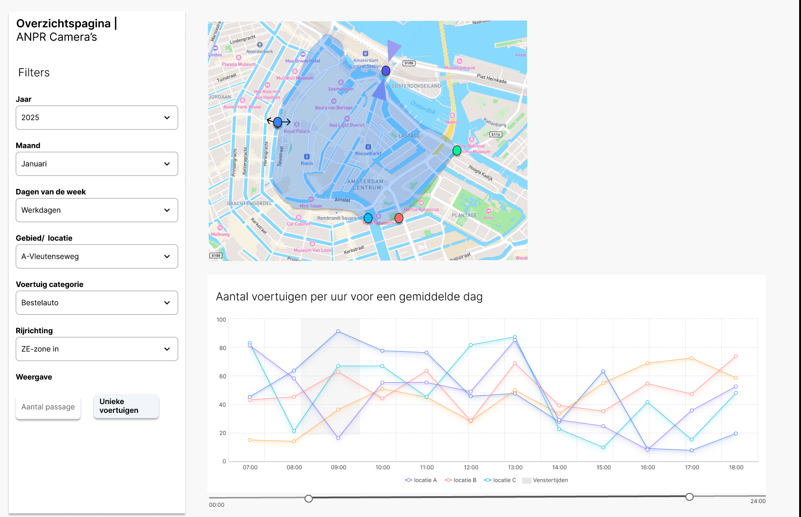

# 4.1 Uurgemiddeldes per camera locatie

Deze visualisatie geeft gemeenten inzicht in het dagelijkse patroon van een geselecteerde
voertuigcategorie. Door tellingen te koppelen aan locatie, tijd en rijrichting ontstaat een helder beeld
van hoe verkeer zich door de dag heen ontwikkelt, en helpt gemeenten bij het monitoren van
logistiek verkeer per locatie.

## Wireframe

---

## Omschrijving benodigde datavelden

[Datavelden voor deze visualisatie](../../data/datavelden/4.1_uurgemiddeldes_per_camera_locatie.yml)

---

## Voorbeeldtabel

[Voorbeelddata (CSV)](../../data/voorbeelddata/4.1_uurgemiddeldes_per_camera_locatie.csv)

