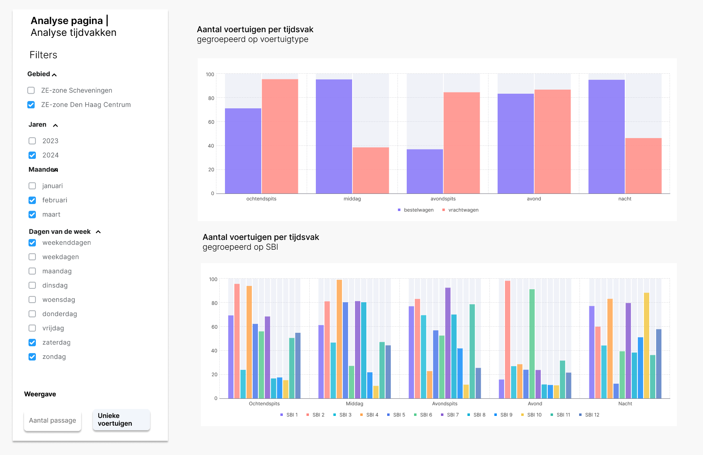

# 4.2 Tijdvak analyse

Deze visualisatie laat zien hoeveel voertuigen per tijdvak de ZE-zone inrijden en hoe deze instroom is verdeeld naar voertuigtypen en sectoren (SBI). Dit kan handig zijn wanneer de venstertijden van de gemeente niet beschikbaar zijn voor het CBS.

## Wireframe

## Omschrijving benodigde datavelden

De datavelden voor deze visualisatie zijn vastgelegd in het YAML-bestand:

- [`4.2_tijdvak_analyse.yml`](../../data/datavelden/4.2_tijdvak_analyse.yml)

## Voorbeeldtabel

Voorbeelddata voor deze visualisatie is opgenomen in het CSV-bestand:

- [`4.2_tijdvak_analyse.csv`](../../data/voorbeelddata/4.2_tijdvak_analyse.csv)

