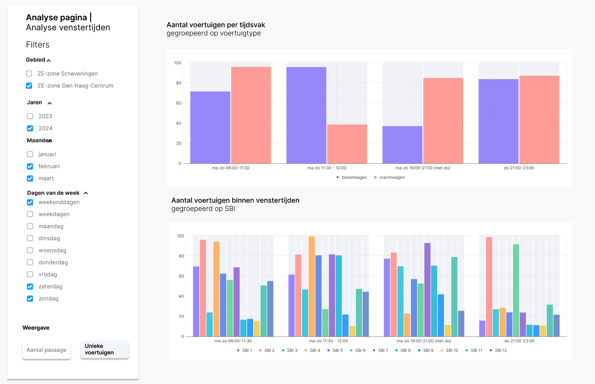

# 4.3 Venstertijden analyse

Deze visualisatie is vergelijkbare met de tijdvak analyse alleen zijn de aantallen geaggregeerd naar de venstertijden, en de tussenliggende blokken, van de betreffende gemeente.

## Wireframe

## Omschrijving benodigde datavelden

De datavelden voor deze visualisatie zijn vastgelegd in het YAML-bestand:

- [`4.3_venstertijden_analyse.yml`](../../data/datavelden/4.3_venstertijden_analyse.yml)

## Voorbeeldtabel

Voorbeelddata voor deze visualisatie is opgenomen in het CSV-bestand:

- [`4.3_venstertijden_analyse.csv`](../../data/voorbeelddata/4.3_venstertijden_analyse.csv)

