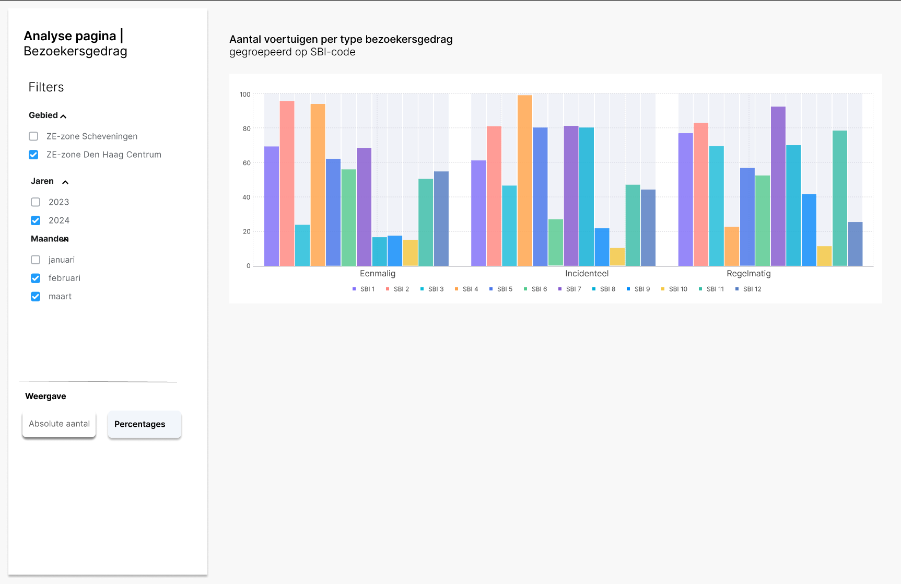

# 4.6 Bezoekersgedrag – SBI

Deze visualisatie laat zien hoe voertuigen die de zone binnenrijden zijn verdeeld naar economische sector (SBI-groep), aangevuld met informatie over het bezoekgedrag van voertuigen: eenmalig, incidenteel of regelmatig. Hiermee wordt inzichtelijk welke sectoren structureel in de zone actief zijn, welke sectoren slechts sporadisch aanwezig zijn, en welke sectoren vooral incidentele ritten veroorzaken.

## Wireframe

## Omschrijving benodigde datavelden

De datavelden voor deze visualisatie zijn vastgelegd in het YAML-bestand:

- [`4.6_bezoekersgedrag_sbi.yml`](../../data/datavelden/4.6_bezoekersgedrag_sbi.yml)

## Voorbeeldtabel

Voorbeelddata voor deze visualisatie is opgenomen in het CSV-bestand:

- [`4.6_bezoekersgedrag_sbi.csv`](../../data/voorbeelddata/4.6_bezoekersgedrag_sbi.csv)

