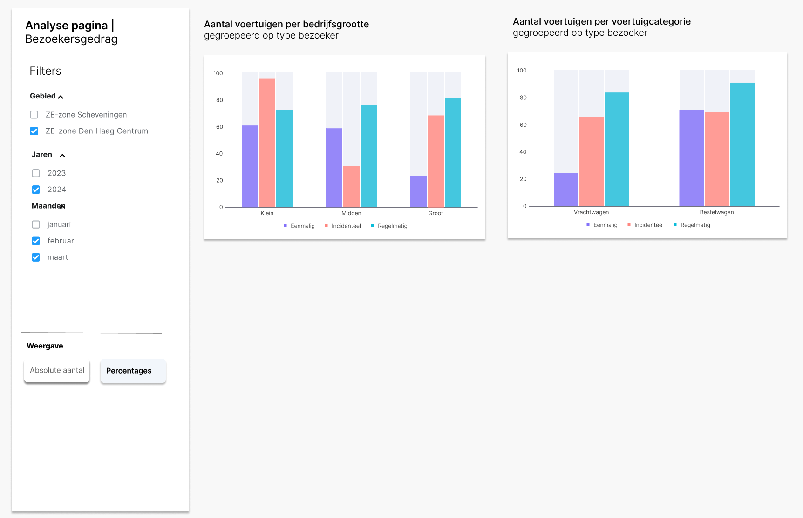

# 4.7 Bezoekersgedrag – bedrijfsgrootte

Deze visualisatie toont hoe voertuigen die de ZE-zone binnenrijden zijn verdeeld naar de bedrijfsgrootte van de kentekenhouder, aangevuld met inzicht in het bezoekgedrag van deze voertuigen. Hiermee wordt zichtbaar welke typen bedrijven (klein, midden of groot) verantwoordelijk zijn voor eenmalige, incidentele of juist structurele bezoeken aan de zone.

## Wireframe

## Omschrijving benodigde datavelden

De datavelden voor deze visualisatie zijn vastgelegd in het YAML-bestand:

- [`4.7_bezoekersgedrag_bedrijfsgrootte.yml`](../../data/datavelden/4.7_bezoekersgedrag_bedrijfsgrootte.yml)

## Voorbeeldtabel

Voorbeelddata voor deze visualisatie is opgenomen in het CSV-bestand:

- [`4.7_bezoekersgedrag_bedrijfsgrootte.csv`](../../data/voorbeelddata/4.7_bezoekersgedrag_bedrijfsgrootte.csv)

